---
# try also 'default' to start simple
theme: seriph
# random image from a curated Unsplash collection by Anthony
# like them? see https://unsplash.com/collections/94734566/slidev
background: https://cover.sli.dev
# some information about your slides (markdown enabled)
title: Ubuntu release at NCHU
info: |
  ## Slidev Starter Template
  Presentation slides for developers.

  Learn more at [Sli.dev](https://sli.dev)
# apply UnoCSS classes to the current slide
class: text-center
# https://sli.dev/features/drawing
lineNumbers: true
drawings:
  persist: false
# slide transition: https://sli.dev/guide/animations.html#slide-transitions
transition: slide-left
# enable Comark Syntax: https://comark.dev/syntax/markdown
comark: true
# duration of the presentation
duration: 80min
favicon: ./public/img//Ubuntu-icon.png
aspectRatio: 16/9
---

# Ubuntu release Party

報告人：中興應數 陳奕其 Each

<div class="abs-br m-6 text-xl">
  <button @click="$slidev.nav.openInEditor()" title="Open in Editor" class="slidev-icon-btn">
    <carbon:edit />
  </button>
  <a href="https://github.com/iach526526" target="_blank" class="slidev-icon-btn">
    <carbon:logo-github />
  </a>
</div>

<!--
The last comment block of each slide will be treated as slide notes. It will be visible and editable in Presenter Mode along with the slide. [Read more in the docs](https://sli.dev/guide/syntax.html#notes)
-->

---
transition: fade-out
---

# 最近的我

- 中興大學興大二村 115 學年度宿舍網管
- SITCON 2026 場務組物流股長
- COSCUP 2026 場務組組長
- NYCU 軟體開發社 HPC team

> email: info AT iach.cc <br>
> blog: www.iach.cc

---

# 大綱
- 簡介作業系統 & Ubuntu
- 製作開機隨身碟
- 安裝日常用軟體
  - 輸入法
  - steam
  - 快捷鍵最佳化
  - 展示黑魔法


---
layout: section
transition: slide-up
---

## 如何和電腦溝通？

你的意圖怎麼傳到硬體運算

---
transition: slide-up
layout: two-cols
layoutClass: gap-x-12
---

## 電腦的主機板們

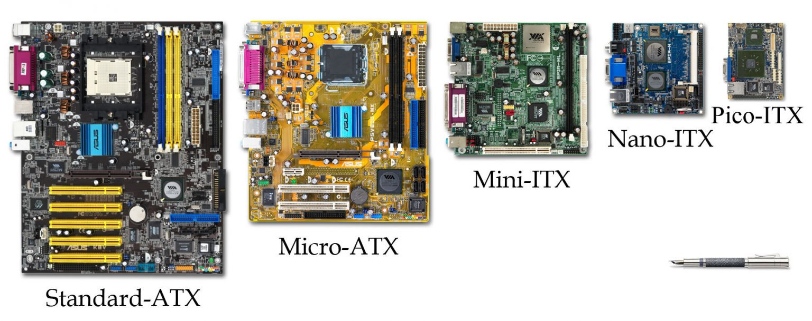

::right::

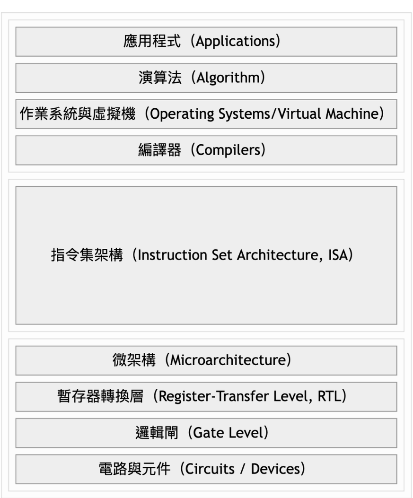


---
layout: two-cols-header
---

## ISA, Instruction Set Architecture 

::left::
- x86-64
- ARM64
- RISC-V

::right::


<style>
  img{
    width:90%  
  }
</style>

---
transition: slide-up
layout: intro
level: 2
---

## 什麼是作業系統

作業系統是隔離使用者和硬體資源的「軟體」，負責有效的分配、存取硬體（硬碟、CPU）資源


---
transition: slide-up
layout: image-right
image: ./public/img//2026-05-10-12-08-13.png
backgroundSize: contain
---

# 作業系統的歷史
- Late 1940s：儲存程式概念（Stored-Program Concept）
  - 范紐曼架構（Von Neumann Architecture）提出
  - 程式與資料共存 → 軟/硬體正式分家
- Mid-1960s：Multics 計劃
  - Bell Labs (AT&T)、MIT、GE 合作
  - 開發大型多人多工系統 → 奠定現代 OS 基礎
- Late 1960s：UNIX 誕生
  - 研究員 Ken Thompson 開發出小型系統 Unics（後更名為 UNIX）
  - 此時 UNIX 是使用 Assembly 撰寫

---
transition: slide-up
layout: image
image: ./public/img//2026-05-16-13-14-25.png
---


---
transition: slide-up
---

## 馮紐曼架構（Von Neumann Architecture）

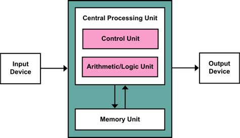


---
layout: two-cols
---
## 馮紐曼瓶頸
- CPU 計算速度 >>> Memory 存取速度
- 使用 Memory Hierarchy 緩解 

::right::
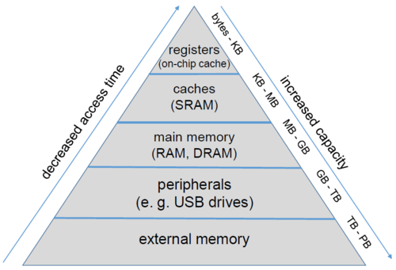


---
transition: slide-up
layout: image-right
image: ./public/img//2026-05-10-12-08-13.png
backgroundSize: contain
---

# 作業系統的歷史

- Early 1970s：C 誕生與普及
  - Ken 開發 B 語言 → 效能不佳 → 失敗
    - Dennis Ritchie 基於 B 語言開發出 C 語言
    - UNIX 使用 C 語言重構 → 獲得 Portability
    - AT&T 受反壟斷法限制 → 低價授權學術界使用 UNIX
- Late 1970s：Berkeley Software Distribution, BSD 誕生
  - UC Berkeley 獲得 UNIX 原始碼 → 大幅改進 UNIX → 發行 BSD
  - BSD 成為學術界主流使用與研究對象

---
transition: slide-up
layout: image-right
image: ./public/img//2026-05-10-12-08-13.png
backgroundSize: contain
---

# 作業系統的歷史
- Early 1980s：AT&T 拆分與 UNIX 授權金暴增
  - AT&T 拆分 → 不受反壟斷法約束 → 將 UNIX（System V）商業化 → 收費閉源
  - BSD 基於 UNIX → 執行 BSD 需支付高額授權
- Mid-1980s：GNU 計劃誕生
  - UNIX 收費閉源 → Richard Stallman 發起 GNU's Not Unix, GNU 計劃
  - 建立完全自由、與 UNIX 兼容的作業系統 → 直到 1980s 末已經完成各種工具 → 缺乏 Kernel

---
layout: image-right
image: ./public/img//2026-05-10-12-08-13.png
backgroundSize: contain
---

# 作業系統的歷史

- Early 1990s：Linux 橫空出世與開源崛起
  - Linux Torvalds 發布開源核心 Linux + 採用 GNU 的授權與工具  + BSD 與 AT&T 正在打官司 → Linux 迅速成為全球開發者協作的首選
- Linux 採用 GNU 的授權與工具 → 奠定現代開源商業與開發模式 
- 1983 微軟推出第一款視窗系統
---
layout: two-cols
---

## Recall
- 作業系統的歷史
- 作業系統
  - 和硬體溝通的軟體

::right::

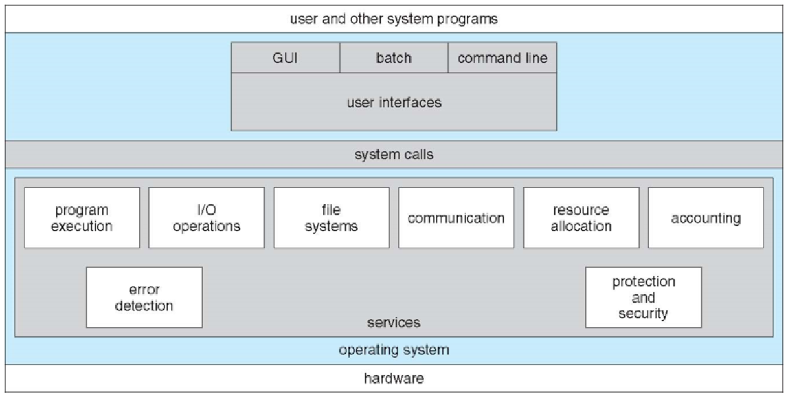

---

## command-line interface,CLI

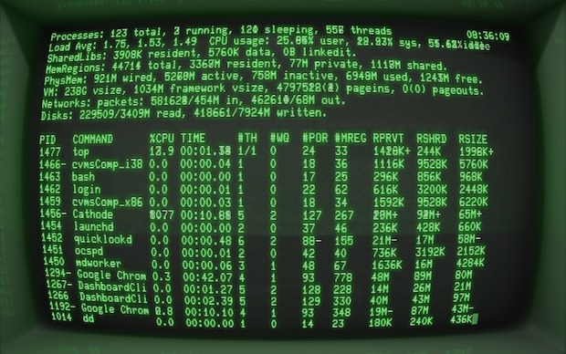

---

## Graphical User Interface, GUI
- 點點按按

<div grid="~ cols-2">
<div>
<figure class="w-[75%]">
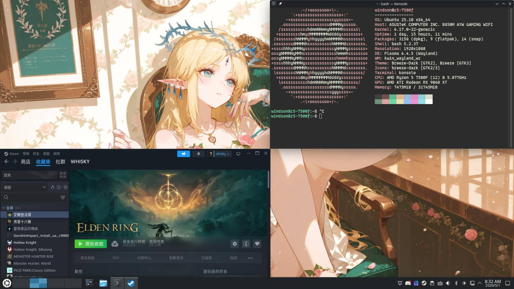
<figcaption>
<a href="https://kde.org"><strong>KDE Plasma</strong></a>, 由 KDE  社群開發
</figcaption>
</figure>
</div>

<div>
<figure class="w-[75%]">
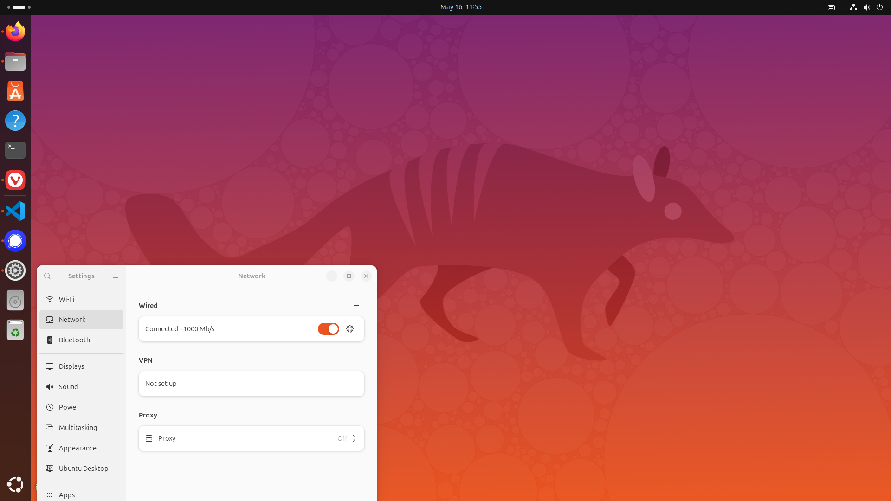
<figcaption>
<a href="https://www.gnome.org/"><strong>GNOME</strong></a>,由 GNOME 基金會和貢獻者開發
</figcaption>
</figure>
</div>
</div>

<div grid="~ cols-2">

<div>
<figure class="w-[75%]">

<figcaption>
<a href="https://en.wikipedia.org/wiki/Aqua_(user_interface)"><strong>macOs Aqua</strong></a>, 由蘋果公司開發
</figcaption>
</figure>
</div>

<div>
<figure class="w-[75%]">
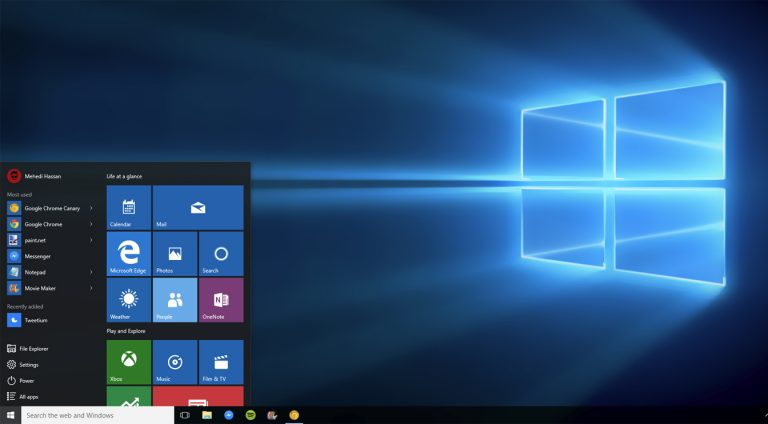
<figcaption>
<a href="https://en.wikipedia.org/wiki/Windows_shell"><strong>Windows Shell</strong></a>, 由微軟開發
</figcaption>
</figure>
</div>

</div>

<style>
div{
  font-size:0.9em;
}
figcaption
{
  text-align:center;
}

  </style>


---
transition: slide-up
---

## Linux 發行版

- 作業系統
  - 人和硬體之間的軟體
  - CLI
  - GUI

- Linux
  - 作業系統的核心部分
  - 負責和硬體溝通
  - 不是完整桌面系統

- 發行版
  - 包裝好的 Linux 作業系統
  - 安裝後可以直接使用
  - 幫你準備好基本工具
---
transition: slide-up
layout: two-cols
---

## Linux 發行版
- 沒人知道到底確切有多少發行版
- 大概有幾百個還在活躍的發行版
- 你也可以做你自己的發行版
::right::
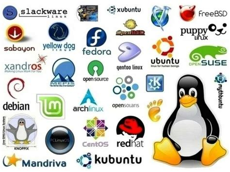

---
layout: center
---

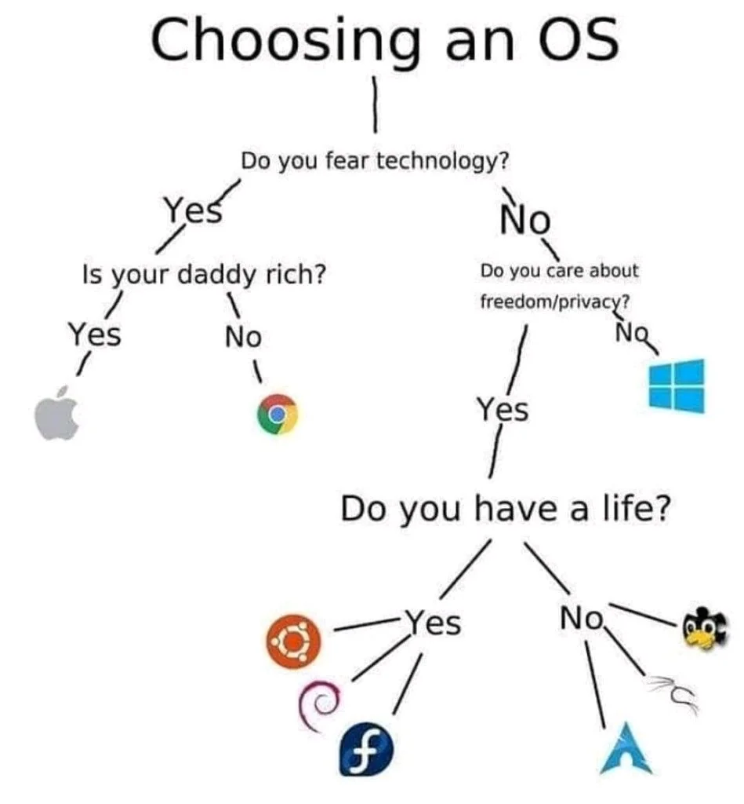

<style>

  img{
    width: 60%;
  }
  </style>
---
lauyout: center
---

# What is [Ubuntu](https://ubuntu.com)?

開源、穩定、適合日常與開發的 Linux 發行版

- 開源 Linux 作業系統
- 可用於桌機、筆電、伺服器與雲端
- 開箱即用
- 有穩定的更新週期
- 社群資源多
  - [askUbuntu](https://askubuntu.com)、[Ubuntu 台灣](https://www.facebook.com/ubuntu.tw/)
<div class="text-sm opacity-60 mt-8">
比較對象是其他 Linux 發行版
</div>


<style>
h1 {
  background-color: #2B90B6;
  background-image: linear-gradient(45deg, #4EC5D4 10%, #146b8c 20%);
  background-size: 100%;
  -webkit-background-clip: text;
  -moz-background-clip: text;
  -webkit-text-fill-color: transparent;
  -moz-text-fill-color: transparent;
}
</style>


---
layout: two-cols
---

## UbuCon Asia 2026 @ COSCUP
- 8/8~8/9
- 入場免費
- 在臺灣科技大學
- 歡迎來玩XD

> 細節見：coscup.org/2026/

::right::

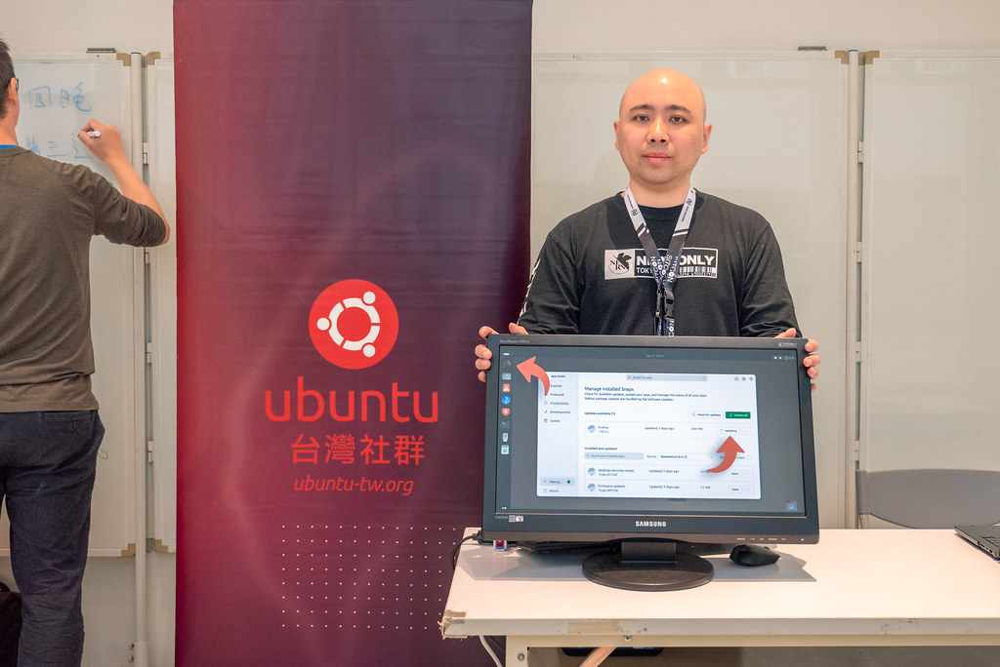


---

## 如何學習用 Linux?
- X 記下所有指令
- Ｏ 直接安裝，~~把電腦打扮成可愛小男娘~~，每天用就會了
- 不要放棄思考、查詢、學習，了解所有事件邏輯的因果關係

---

## 更多 Linux 桌面環境！

<div grid="~ cols-2">
<div>
<figure class="w-[75%]">
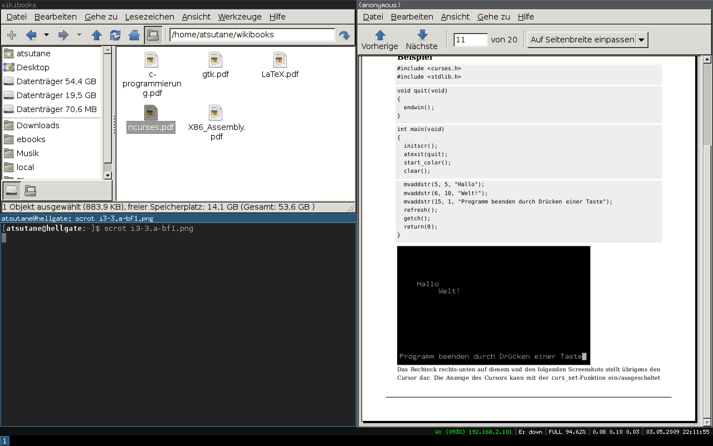
<figcaption>
<a href="https://i3wm.org/"><strong>i3</strong></a>
</figcaption>
</figure>
</div>

<div>
<figure class="w-[75%]">
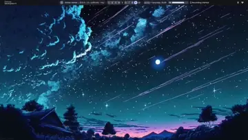
<figcaption>
<a href="https://hypr.land/"><strong>hyperland</strong></a>
</figcaption> 
</figure>
</div>
</div>

<div grid="~ cols-2">
<div>
<figure class="w-[75%]">
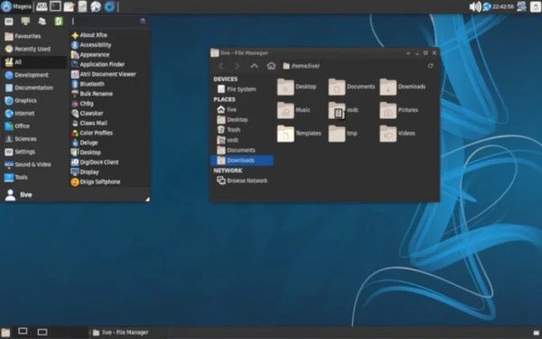
<figcaption>
<a href="https://kde.org"><strong>xfce</strong></a>
</figcaption>
</figure>
</div>

<div>
<figure class="w-[75%]">
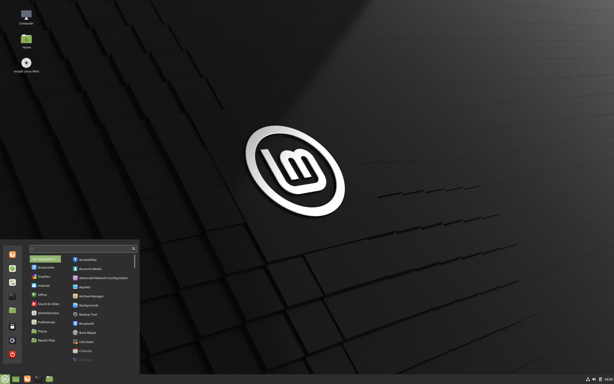
<figcaption>
<a href="https://cinnamon-spices.linuxmint.com/"><strong>Cinnamon</strong></a>
</figcaption>
</figure>
</div>
</div>

<style>
div{
  font-size:0.9em;
}
figcaption
{
  text-align:center;
}

  </style>
---

## 我接觸 Linux 的經驗
1. 學長準備遠端伺服器讓我玩
2. 為了考證照，第一次使用 Ubuntu 桌面版=>背了一些好長的指令好痛苦啊啊啊
3. 使用特殊的發行版 kail 練習資安攻擊手法
4. 把家裡常用的裝置作業系統都換成 Linux
5. 放假裝了各種發行版，在家搞 homelab

---

## 如何安裝各種軟體

App Center / APT → Snap / Flatpak → 官方 DEB → AppImage → BIN/SH → 原始碼編譯

| Linux / Ubuntu 方式  | 類比 Windows                     | 說明                                    |
| ------------------ | ----------------------------------- | ------------------------------------- |
| **DEB**            | **`.msi` 或安裝用 `.exe`**              | 官網下載後安裝進系統，例如 Chrome、Discord 的 `.deb` |
| **AppImage**       | **可攜式 `.exe`**                      | 下載後直接執行，不太需要正式安裝，像 Windows 可攜式軟體    |
| **BIN / SH**       | **廠商自製安裝器 `.exe`**                  | 比較像「下一步、下一步」那種安裝程式，但在 Linux 可能是腳本     |
| **APT**            | **Microsoft Store / winget / 軟體倉庫** | 幫你下載、安裝、更新軟體的工具              |
| **App Center**     | **Microsoft Store**                 | 圖形化軟體商店                               |
| **Snap / Flatpak** | **Microsoft Store App / 沙盒化 App**   | 比較像由平台管理、可自動更新、隔離程度較高的 App            |
| **原始碼編譯**          | **自己拿程式碼 build 成 exe**              | You are real geek!                        |

<style>
  td{
    font-size:0.8rem;

  }
</style>
---
transition: slide-up
---

## App Center

- Ubuntu 的「應用商店」(可以理解成 microsoft store、Google play 商店)
- 自動呼叫背後的套件管理系統來安裝軟體


---
layout: two-cols
transition: slide-up
---

## APT(Advanced Package Tool)

- 幫你下載、安裝、更新軟體的工具
- 通常會去「軟體倉庫」找對應的 .deb
::right::


---
layout: two-cols
transition: slide-up
---

## 什麼是軟體倉庫

- 官方或可信任的倉庫貨架，會上架很多軟體
- 鏡像站把國外的軟體倉庫定期複製到台灣，讓你下載更快
  - [NCHC 國網中心](https://free.nchc.org.tw/pmwiki/pmwiki.php/FSLab/MirrorLists?utm_source=chatgpt.com)
  - [NYCU CSIT / 交大資工鏡像站](https://it.cs.nycu.edu.tw/equipment-linux-mirror?utm_source=chatgpt.com)

::right::

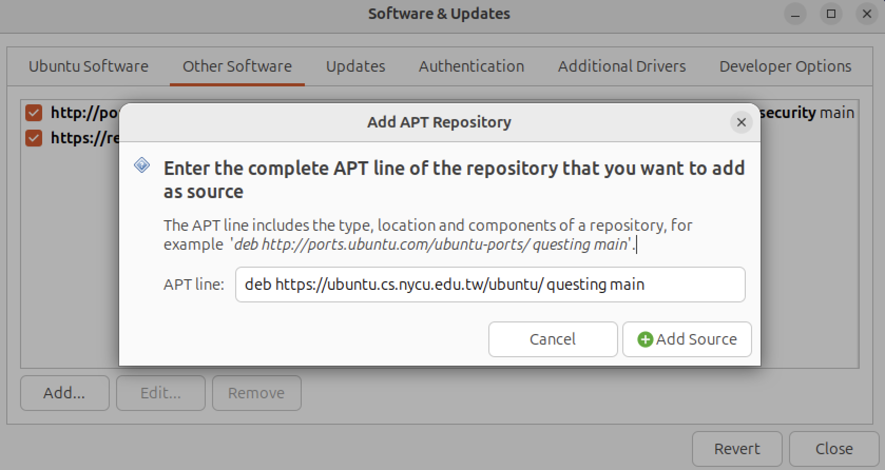

<style>
img{
  width:110%;
}

</style>
---
layout: two-cols-header
---

## deb
::left::


- 包含一個軟體安裝時需要的東西
  - 程式本體
  - 圖示
  - 設定檔
  - 安裝說明
  - 版本資訊
  - 相依套件清單

::right::


<div id="under-img">Discord 就是提供 deb 安裝</div>

<style>
#under-img{
  text-align:center;
}

</style>
---

## [flatpak](https://flatpak.org/setup/)

```bash
sudo apt install flatpak
sudo apt install gnome-software-plugin-flatpak
flatpak remote-add --if-not-exists flathub https://dl.flathub.org/repo/flathub.flatpakrepo
```

---
image: ./public/img//miku.webp
layout: image-right
backgroundSize: contain
transition: slide-up
---

## 來安裝酷酷的動態桌布！

- 使用 [Hidamari](https://github.com/jeffshee/hidamari)
- 文件建議 flatpak 用執行，flatpak 你在上一張投影片裝好了
```
flatpak install flathub io.github.jeffshee.Hidamari
# 設定開機自啟動
mkdir -p ~/.config/autostart

cat > ~/.config/autostart/hidamari.desktop <<'EOF'
[Desktop Entry]
Type=Application
Name=Hidamari
Comment=Start Hidamari video wallpaper
Exec=flatpak run io.github.jeffshee.Hidamari -b
Terminal=false
X-GNOME-Autostart-enabled=true
EOF

```
---

把影片預先放在 `~/Videos/Hidamari`  就可以選中播放，也可以設定隨機輪播或播放影片、網頁


---


## 文書作業

- Office-> Libre office
- Adobe Acrobat Reader -> Evince、Okular、Loupe
- 小畫家-> inkscape、GIMP、Krita
- Steam 遊戲 == 裝 [Proton](https://www.protondb.com/) 就可以繼續玩了 

---
transition: slide-up
---

# 輸入法
我都用[小麥注音](https://github.com/openvanilla/fcitx5-mcbopomofo)，你可以裝[新酷音](https://chewing.im/download.html)就可以不用編譯

- 小麥需要自己編譯，參考[官方文件](https://github.com/openvanilla/fcitx5-mcbopomofo/blob/master/README.md#%E5%AE%89%E8%A3%9D%E6%96%B9%E5%BC%8F)複製貼上
  - 別怕真的很簡單，複製貼上而已
- 不想自己編譯可以安裝新酷音
---
transition: slide-up
---

## 什麼是「編譯」？


---

# Setup

```bash
git clone https://github.com/openvanilla/fcitx5-mcbopomofo.git
cd fcitx5-mcbopomofo
sudo apt install \
    pkg-config fcitx5 libfcitx5core-dev libfcitx5config-dev libfcitx5utils-dev fcitx5-modules-dev \
    cmake extra-cmake-modules gettext libfmt-dev libicu-dev libjson-c-dev

cmake -B build -DCMAKE_INSTALL_PREFIX=/usr -DCMAKE_BUILD_TYPE=Release
cmake --build build
sudo cmake --install build

# 初次安裝後，執行以下指令，小麥注音 icon 就會出現在 fcitx5 選單中
sudo update-icon-caches /usr/share/icons/*
```

---
layout: two-cols
layoutClass: gap-x-12
---

## 安裝 Nvidia驅動 （以 RTX3060 為例）

- [找到驅動版本](https://www.nvidia.com/en-us/drivers/)，但不要用 .run  安裝，使用 apt 

```bash
ubuntu-drivers devices # 偵測合適的版本
sudo apt install nvidia-driver-595-open nvidia-utils-595

```

::right::

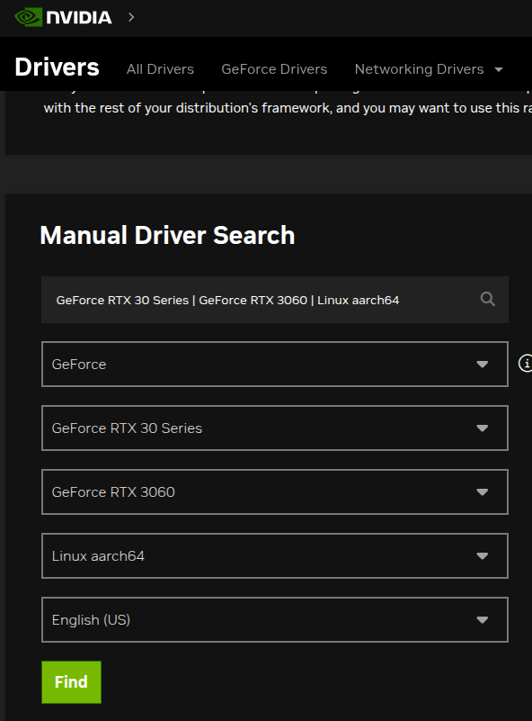

<style>

img{
  width:80%;
}
  </style>

---

## 試裝我的電腦

```bash
bm4ltb@BM5642:~$ ubuntu-drivers devices
udevadm hwdb is deprecated. Use systemd-hwdb instead.
== /sys/devices/pci0000:00/0000:00:01.0/0000:01:00.0 ==
modalias : pci:v000010DEd00002487sv000019DAsd00004630bc03sc00i00
vendor   : NVIDIA Corporation
model    : GA104 [GeForce RTX 3060]
driver   : nvidia-driver-595-server - distro non-free
driver   : nvidia-driver-535-open - distro non-free
driver   : nvidia-driver-535-server-open - distro non-free
driver   : nvidia-driver-595-server-open - distro non-free
driver   : nvidia-driver-580-server - distro non-free
driver   : nvidia-driver-535-server - distro non-free
driver   : nvidia-driver-580 - distro non-free
driver   : nvidia-driver-580-open - distro non-free
driver   : nvidia-driver-535 - distro non-free
driver   : nvidia-driver-470 - distro non-free
driver   : nvidia-driver-595 - distro non-free
driver   : nvidia-driver-470-server - distro non-free
driver   : nvidia-driver-595-open - distro non-free recommended
driver   : nvidia-driver-580-server-open - distro non-free
driver   : xserver-xorg-video-nouveau - distro free builtin
```

重開機後跑 `nvidia-smi` 看到狀態表格就代表裝成功了。
---

# 如何移機
- Windows
  - 備份資料，覆蓋系統碟（ C 槽）
- MacOs
  - 取決你使用的 CPU 晶片
    - M 系列晶片：[Asahi Linux](https://asahilinux.org)
    - intel :和一般筆電安裝流程一樣
---
layout: quote
---

## 我怕我的電腦壞掉

##### ~~那就不要怕~~

---
layout: intro
---

## 演示時間
以我的舊 Window 10 筆電為例
---

# 參考資料（推薦閱讀）
-  [YouTube: The Fun Way to Learn Linux](https://www.youtube.com/watch?v=zn2vJNSfSo4)
- [談flatpak 等安裝格式原理](https://forum.gamer.com.tw/C.php?bsn=60030&snA=630254)
- [受够了 MacOS，我给 Macbook 装上了 Linux](https://blog.l3zc.com/2023/11/installing-ubuntu-on-macbook/)
- [Linux on MacBook experience](https://www.youtube.com/watch?v=GiXHkRc8axM)
- [Ubuntu繁體中文輸入法？改用Fcitx5來輸入中文吧！](https://ivonblog.com/posts/ubuntu-fcitx5/)
- [鳥哥的學習私房手冊-linux_basic](https://linux.vbird.org/linux_basic/centos7/0105computers.php)
- [What Are the Components of a Linux Distribution?](https://fosspost.org/what-are-the-components-of-a-linux-distribution)
---

# 參考資料（看不完的那種）
- text book : UNIX The Textbook, Third Edition | By Syed Mansoor Sarwar, Robert M. Koretsky
- Computer Systems A Programmer’s Perspective THIRD EDITION : The compilation system
